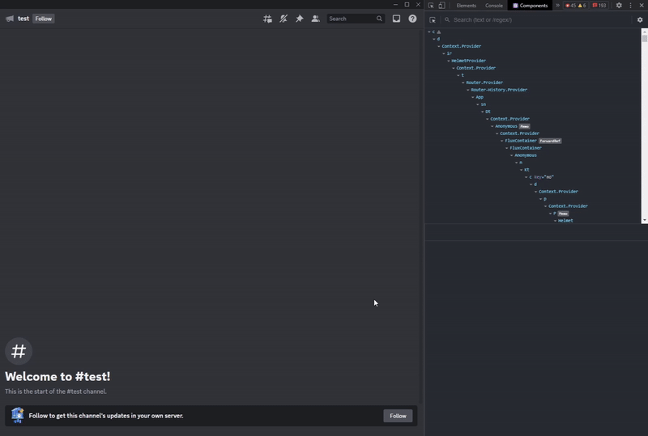

## React Developer Tools

From v4.6.0, Replugged comes with the possibility to enable the
[React Developer Tools](https://react.dev/learn/react-developer-tools) extension. With the React
DevTools you can inspect the React tree and debug more easily.

### How to enable

React DevTools can be enabled in Replugged's General Settings, under the Advanced Settings category,
and after a client relaunch, you'll be ready to use the extension.

### How to use

React DevTools come together with the Chrome DevTools (<kbd>Ctrl</kbd> + <kbd>Shift</kbd>
+&nbsp;<kbd>I</kbd> or <kbd>Cmd</kbd> + <kbd>Shift</kbd> + <kbd>I</kbd>) in two new panels called
exactly `⚛️ Components` and `⚛️ Profiler` (if you don't see them, they may be hidden in the dropdown
menu).

The `⚛️ Components` panel will become a very useful companion when looking for a React component's
source. It will be enough to select the component, after activating the option of selecting an
element in the top left corner, and click on the `< >` icon in the panel next to the tree.



## Development Companion Extension

Replugged v4.3.0 contains support for
[Vencord's dev companion extension](https://marketplace.visualstudio.com/items?itemName=Vendicated.vencord-companion).
It is an extension for VSCode that allows you to test your module finds and plaintext patches
without having to rebuild your plugin and reload your client.

After installing, your module finds and plaintext patches should now have small texts like "Test
Find" and "Test Patch" above them. Clicking them will show a notification within VSCode with
diagnostics about the result.

:::note

For plaintext patches to work, your patch MUST have a `find`! The extension was not made to parse
patches without them.

```ts
export default [
  {
    find: "SOMETHING",
    replacements: [{}],
  },
];
```

:::
